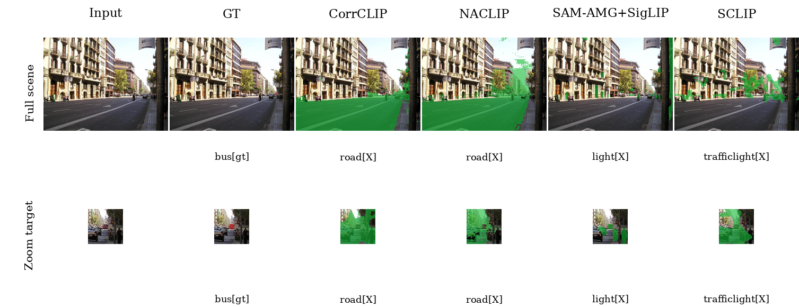

# Case Study: Small-Object Degradation on ADE-150 Bus

Image: `ADE_val_00001803`
Target region: `bus` (class id 80, area 90 px)

| Method | Dominant predicted class on GT region | Class match | Mask IoU vs target | Overlap pixels |
|---|---:|---:|---:|---:|
| CorrCLIP | road | no | 0.001 | 90 |
| NACLIP | road | no | 0.000 | 56 |
| SAM-AMG+SigLIP | light | no | 0.007 | 88 |
| SCLIP | trafficlight | no | 0.003 | 90 |

Takeaway: this example illustrates the small-component failure mode. The target class occupies only a tiny region, so methods either miss it entirely or bind nearby/contextual pixels to a wrong class. It supports the component-scale evidence that small regions degrade much more sharply than large ones.
